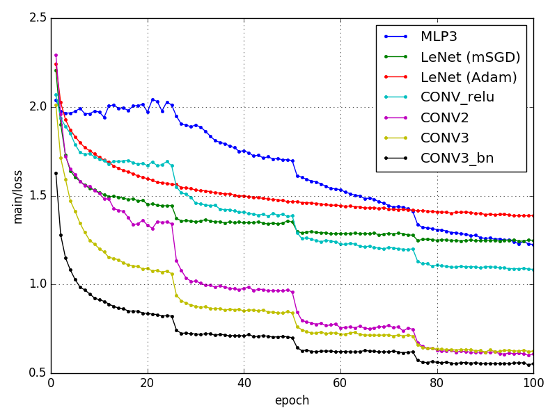
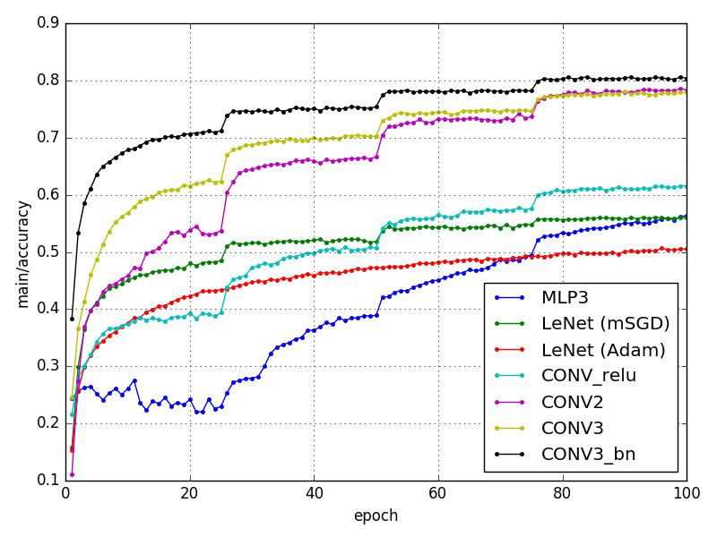
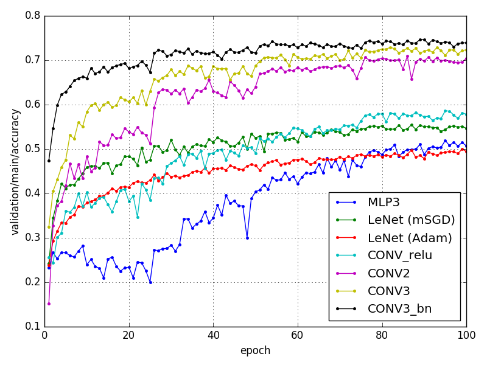

# chainer_cifar10

## Overview

- ChainerでCIFAR-10の画像認識
- examplesよりもシンプルな構造のニューラルネットワークで学習

## Requirements

- Python 3.5
- Chainer 1.21.0
- matplotlib

## Usage

```
$ python train_cifar10.py
```

- すべてデフォルトのオプションで実行
- オプションの意味は`-h (--help)`を参照
- オプションの使用例は`run.sh`を参照

### Options

新たに追加したオプション

- -m (--model) モデルアーキテクチャを指定

    - MLP3: 多層パーセプトロン
    - LeNet: シンプルな畳み込みニューラルネットワーク
    - Conv_relu: LeNetのSigmoidをReLuに置き換え
    - CONV2: 畳込みブロックを2回繰り返す
    - CONV3: 畳込みブロックを3回繰り返す
    - CONV3_bn: Batch normalizationを追加

## Results

ニューラルネットのモデルを変えたときの結果

- cifar10_loss （訓練データの損失）

    

- cifar10_acc （訓練データの精度）

    

- cifar10_val_loss （検証データの損失）

    

- cifar10_val_acc (検証データの精度)

    

## Reference

- [chainer/examples/cifar](https://github.com/pfnet/chainer/tree/master/examples/cifar)

## License

MIT License
